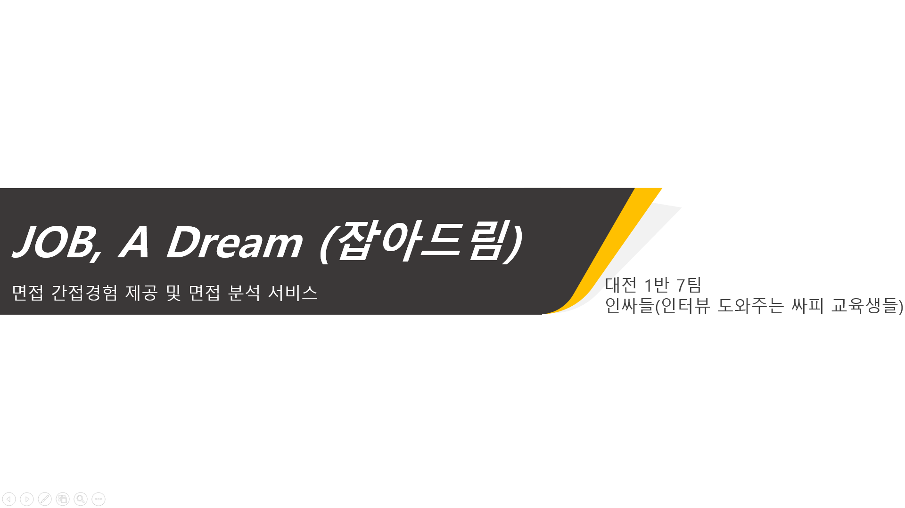
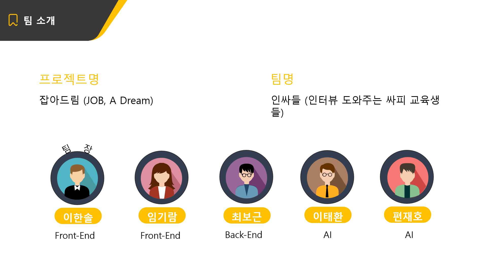
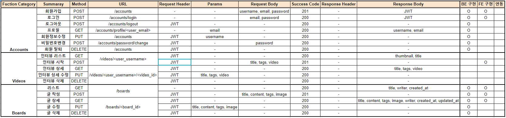
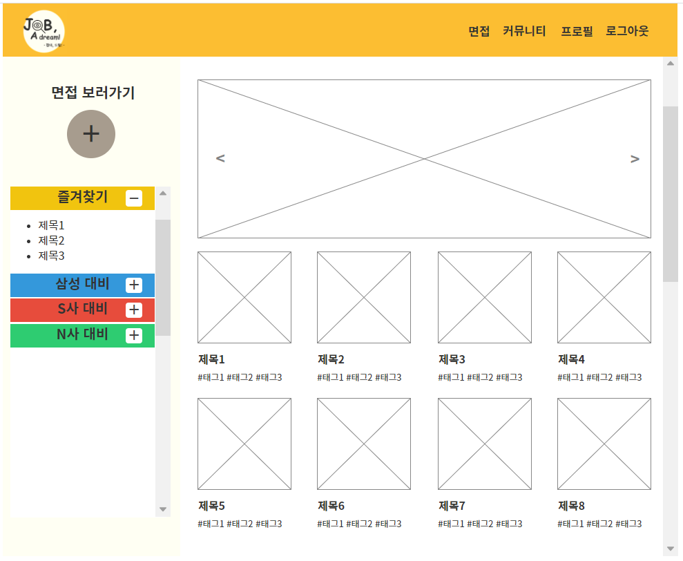

### :family: TEAM

> 팀명 '인싸들'의 의미는 '인터뷰를 도와주는 싸피 교육생들'입니다. 프로젝트 주제와 어울리는 팀명으로 변경했습니다.




### :computer: PROJECT

> 언어적, 비언어적 습관을 AI 기술들을 활용해 분석함으로써 면접을 보는 중 나도 모르게 나오는 버릇, 습관을 캐치합니다. 이로써 취업 준비 과정에 도움을 주겠습니다.

#### 1. 서비스명

- 잡아, 드림!(Job, A Dream!)

#### 2. 주요기능

- STT (Speech to Text) 기술을 통해 면접 답변을 대본으로 볼 수 있습니다.
- Eye Tracker, Emotion Detection 기술을 통해 시선처리, 표정변화 등에 대한 데이터를 볼 수 있습니다.

#### 3. 기대효과

- 시공간 제약을 극복하고 면접을 간접경험하며 면접에 익숙해질 수 있습니다.
- AI로 분석된 데이터를 통해 언어적, 비언어적 습관을 개선할 수 있습니다.
- 나의 면접 데이터를 확보할 수 있습니다.
- 커뮤니티 기능으로 객관적인 피드백을 받을 수 있습니다.

#### 4. 기술스택

- Frontend: React, Redex -> Vue, Vuex
- Backend: Spring -> Django
- AI: Python (기술에 대한 자세한 내용은 하단 참조)
- 버전관리: GitLab

#### 5. 설치

- Backend

```bash
$ python -m venv venv
$ source venv/Scripts/activate

$ pip install -r requirements.txt
$ python manage.py runserver 8080
```

- React-Frontend

```bash
$ yarn install
$ yarn start
```

- Vue-Frontend

```bash
$ yarn install
$ yarn serve
```

#### 6. ERD 설계

> https://www.erdcloud.com/d/8EaoSiWMtbK9Dqi6E


#### 6. API 설계

> https://docs.google.com/spreadsheets/d/1rtpMDVltVEq-tSIKOwCbgSPeq6TJ0BY-QFQIUvwKgtg/edit#gid=2126308176



#### 7. 와이어 프레임 설계

>https://ovenapp.io/view/q5WmjIhc2wktn4Z5QXGxO0OkYnKncBsF/htYl3



#### 8. AI 기술

1. __STT__ Speech to Text (= __ASR__ Automatic Speech Recognition)

- Google Cloud API에서 제공하는 Speech-To-Text를 사용하였다.

  - FLOW (비동기 방식)

    ```
    # 1. 영상이 저장된 Path를 담은 요청을 Google Cloud Storage로 보내어 클라우드에 영상을 저장한다.
    # 2. Google Cloud Storage에서는 STT 과정을 수행하여 transcript 및 confidence를 담은 정보를 응답한다.
    # 3. 응답받은 내용을 분석하여 자연어처리를 수행하고 명사를 추출하여 시각화 자료로 응용한다.
    ```

- ESPnet을 이용한 음성인식 (진행중)

  - FLOW(Traning & Test)

    ```
    # 1. AI server에 Kaldi와 espnet의 환경을 구축한다.
    # 2. 한국어 Model인 zeroth_korean을 이용하여 음성데이터를 학습한다.
    # 3. ...
    ```

    